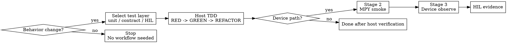

# embedded-development

# Overview
统一本仓库的开发入口：先按 `unit/contract/HIL` 选对测试层，再按是否进入设备路径决定是否继续执行 `stage1 -> stage2 -> stage3 -> HIL`。这个 skill 同时覆盖分层 TDD、设备门禁、硬件集成与实时性约束，避免多个 skill 在同一任务里重复触发。

核心原则：**行为改动必须先有失败测试；进入设备路径后，主机侧通过只是起点，不是终点。**

## Required Background
- **REQUIRED SUB-SKILL:** superpowers:test-driven-development
- **REQUIRED SUB-SKILL:** `mpy-cli`
- **REQUIRED SUB-SKILL:** `verification-before-completion`
- 涉及 PID、运动学、里程计或轨迹行为时，追加 `control-system`

## When to Use
- 新增功能、修复问题、重构行为，需要判断先写 `tests/unit/`、`tests/contract/` 还是 `tests/hil/`
- 改动触及 `src/services/transport_car.py`、`src/hardware/`、外设驱动、实时控制循环或板端状态机
- 需要验证 UART、PWM、电机、编码器、IMU、ticker、5ms 控制周期预算
- 需要执行板端 smoke、设备观测、HIL 留证，或你已经发现主机 `pytest` 不能充分证明结果

不要用于：
- 纯文档修改
- 不改变行为的纯重命名或纯格式整理



## Step 1: Select Test Layer

### `tests/unit/`
- 纯逻辑、确定性算法、解析器、路由、存储、工具函数
- 目标是最快锁定输入输出和边界条件

### `tests/contract/`
- `src/services/commands/`、命令处理器、协议路由、副作用契约
- 目标是锁定命令入口、返回结构、错误路径与注册行为

### `tests/hil/`
- 真实设备、真实时序、真实外设、真实控制循环验证
- 当改动触及硬件路径时，`tests/hil/` 是最终留证层，不是可选项

## Step 2: `stage1` Host TDD Gate
1. 先写失败测试（RED），并确认失败原因与预期一致
2. 再写最小实现（GREEN）
3. 保持通过后再重构（REFACTOR）
4. 运行对应主机测试，直到目标范围全绿

常用命令：

```bash
python3 -m pytest tests/unit -q
python3 -m pytest tests/contract -q
python3 -m pytest tests/unit tests/contract -q
```

进入下一阶段前必须满足：
- 对应失败测试先写且失败原因为预期
- 主机侧目标测试全绿
- 没有已知但未覆盖的协议入口、状态机分支或异常路径

## Step 3: Decide Whether This Is a Device Path
满足任一条件，就进入设备路径：
- 修改了 `src/hardware/`
- 修改了 `src/services/transport_car.py`
- 变更依赖真实串口、编码器、IMU、电机、ticker 或板端状态
- 需要证明 5ms 控制周期预算、方向一致性、传感器稳定性或真实动作链路

若以上都不满足，则在主机侧验证通过后即可结束。

## Step 4: Device Stages

### `stage2` MPY smoke
目的：验证连接、同步、导入、安全探针、最小查询链路与裸片最小运行是否正常，不验证真实硬件动作。

默认做法：
- 先用 `mpy-cli plan`
- 再用 `mpy-cli upload/run/delete`
- 运行安全 smoke 探针，例如 `tools/run_stage2_smoke.py`

必须验证：
- 设备可连接
- 目标文件可上传与执行
- 运行时模块可导入
- 需要的 query / smoke 接口已注册
- 若存在安全模式，其入口可见且可用

禁止项：
- 不要在 `stage2` 里直接启动真实电机、编码器或 IMU 动作链路
- 不要把 `stage2` 失败当成“板子问题”后直接跳过

### `stage3` Device observe
目的：在真实设备运行下通过 `uart3` 做人工调试，确认具体逻辑行为和故障归因。

默认做法：
- 保持 `uart6` 继续服务 OpenArt 或正式通信链路
- 通过 `uart3` 人工发送查询或调试命令，读取 `health/tick/imu/enc/motor/vision` 等快照
- 由人和 AI 在环分析现象，不再把 `stage3` 当作自动 PASS / FAIL 脚本

必须验证：
- 状态可读且格式稳定
- 失败可归因
- 关键实时约束未被破坏，尤其是 5ms 控制周期预算

### `HIL` evidence
目的：把真实板结果留在 `tests/hil/`，作为最终完成证据。

必须包含：
- 操作步骤或测试命令
- 预期行为
- 实际输出或测量结果
- PASS / FAIL 结论

## Hardware And Real-Time Guardrails
- 每个外设一个独立模块，接口最小化，业务编排放 `services/`
- 驱动层不夹带业务逻辑，避免跨层耦合
- 已知 `src/boot.py` 的 Button 1-4 板级引脚分别为 `C8`、`C9`、`C14`、`C15`
- 已知 `src/boot.py` 的 D8/D9 角色输入带上拉电阻, 读到 `1` 表示开关关闭, 读到 `0` 表示开关闭合; 讨论主辅车角色时必须区分输入电平与物理开关状态
- 任何硬件引脚、接线、板级资源映射信息若未在仓库或用户指令中明确给出，必须先向用户确认，禁止凭空假设
- 串口处理默认非阻塞，避免等待式读取
- PWM、方向切换与占空比限幅要原子化处理
- 中断回调只置标志，不执行重计算或阻塞 I/O
- 关键路径避免动态分配和大字符串操作
- 新增逻辑必须评估耗时，建议用 `ticks_us` 量测
- 若控制周期超预算，先降复杂度，再讨论新特性
- 电机方向、编码器方向与运动学坐标系必须一致
- IMU 设备 ID、零漂校准文件和读数稳定性必须可验证

## 视觉对正符号与状态语义

只要任务触及视觉对正、`src/services/transport_car.py`、`?vision`、`?health`、板端 observe 或 HIL，就先把下面这组语义钉死，再谈调参。

先固定 4 个基线：
- 以 `docs/Protocol.md`、`src/services/vision_protocol.py`、`src/services/vision_state_machine.py` 为准；若你看到 `src/control/kinematics.py` 旧注释里的“X 前 / Y 左”，视为历史残留，不要拿它推断当前协议方向
- 车体系方向：`y+` = 前进，`x+` = 右移，`omega+` / `d_angle+` = 顺时针；`dx/dy/d_angle` 是车体系相对增量，`x/y/angle` 是世界系绝对目标
- 视觉输入只认 `UART6` 上完整框 `left,top,right,bottom`；旧 `x,y` 或混合载荷会被视觉协议吞掉，不再落回遥控协议
- `left/top/right/bottom` 已经是 OpenArt 做完 `hmirror/vflip` 后的最终画面坐标，主控侧不得再次翻转；所有 `center_x`、`bottom` 判据都基于这张最终画面

### 控制量与误差量方向

| 量 | 正值语义 | 当前实现里的直接含义 |
| --- | --- | --- |
| `x_error = obs.center_x - target_center_x` | 目标框中心在画面目标点右侧 | 画面右偏 |
| `y_error = obs.bottom - target_bottom` | 目标框底边比期望更靠下 | 画面下偏 / 更贴近底边 |
| `dx_body` | 车体向右横移 | `ALIGN_DX`、`PUSHING` 的横移修正量 |
| `dy_body` | 车体向前 | `ALIGN_DIST` 和 `PUSHING` 的纵向推进量 |
| `d_angle_deg` / `omega` | 车体顺时针旋转 | 旋转修正量 |
| `heading_error = normalize(push_angle_deg - heading_deg)` | 当前航向还需要顺时针补偿 | 与 `d_angle_deg` 同号输出 |

把状态机里的符号关系直接记住：
- `ALIGN_ANGLE`：`x_error > 0 -> d_angle_deg > 0`，也就是目标在画面右边时，当前实现会给顺时针转向
- `ALIGN_DX`：`x_error > 0 -> dx_body > 0`，也就是目标在画面右边时，当前实现会给车体右移
- `ALIGN_DIST`：`dy_body = -y_error * kp`，因此 `obs_bottom` 偏上时 `y_error < 0 -> dy_body > 0`，车辆应前进；`obs_bottom` 偏下时则后退
- `ORBITING` / `PUSHING` / `RETURNING`：`heading_error > 0 -> d_angle_deg > 0`，都按“还需要顺时针补偿”理解
- `push_dy_m > 0` 表示沿车体 `y+` 推行；默认推行阶段是前推，不是后退

关于“绝对物理方向”再补一条硬约束：
- 当前仓库只明确了符号方向，没有把 `0 deg` 绑定到赛场东南西北；`push_angle_deg = -90` 只能解释为“相对当前复位零点的绝对航向目标”，没有 HIL 证据前，不要把它口头改写成“朝左 / 朝右 / 朝前 / 朝后”
- 凡是说“左 / 右 / 前 / 后 / 顺时针 / 逆时针”，必须同时标明参考系是画面、车体还是世界；不带参考系的描述一律视为高风险描述

### 画面语义与物理动作对照

- 当前视觉链路默认采用“杆上斜装、朝地板俯视”的类人视角；目标默认位于地板平面，这两个前提共同决定了 `bottom` 可作为接近程度代理量
- 画面坐标按像素常规理解：`left -> right` 递增，`top -> bottom` 递增
- `obs_center_x` 变大，表示目标在最终画面里向右；在当前斜俯视几何下，车越靠近地板上的目标，目标框底边通常越接近画面底边，也就是 `obs_bottom` 越大；车越远离目标，`obs_bottom` 越小
- 当前对正策略不是“读视觉角度”，而是“用画面误差驱动动作”：
  - `ALIGN_ANGLE` 不是测物体角度，而是用旋转消除 `center_x` 横向误差
  - `ALIGN_DIST` 不是米制真实距离，而是在“斜俯视 + 地板平面目标”前提下，用 `bottom` 近似代理纵向远近
  - `ALIGN_DX` 不是世界系 `dx`，而是车体系 `dx_body` 最终横移对齐
- 只有当相机安装姿态、镜头朝向、目标高度和地面关系基本稳定时，`bottom` 这个代理量才可靠；若目标被抬起、滚落、悬空、明显倾倒，或镜头安装角被改动，就不能把 `bottom` 继续当成稳定距离代理
- 若现场观察到“物体向镜头右边移动但 `obs_center_x` 变小”或“物体远离镜头但 `obs_bottom` 变大”，优先检查 OpenArt 翻转配置、镜头安装方向和视觉发送格式，不要先改状态机符号

### 对齐状态标识

| 状态 | 当前真实判据 | 主输出 | 常见误解 |
| --- | --- | --- | --- |
| `IDLE` | 等待有效完整框观测 | 无 | 不是故障态 |
| `ALIGN_ANGLE` | 看 `center_x` 是否进横向死区 | `d_angle_deg` | 名字像“角度对齐”，实际是在做水平居中 |
| `ALIGN_DIST` | 看 `bottom` 是否进纵向死区 | `dy_body` | 名字像“真实距离”，实际是底边像素判据 |
| `ALIGN_DX` | 再次看 `center_x`，做最终横移确认 | `dx_body` | 这里的 `DX` 是车体系横移，不是世界系 `dx` |
| `ORBITING` | 看 `heading_error` 是否满足推行朝向 | `d_angle_deg` + `rear_only_mode=True` | 主要做朝向补偿 |
| `PUSHING` | 沿 `push_angle_deg` 前推，保留少量横移纠偏 | `push_dy_m` + 小 `dx_body` + `d_angle_deg` | 不要默认等同“后轮模式” |
| `RETURNING` | 转到 `push_angle_deg + 180` | `d_angle_deg` | 不再输出位移目标 |
| `DONE` | 停留观察窗口，随后回 `IDLE` | 无 | 不是永久完成态 |

关键跳转原因按当前注册名理解：
- `OBSERVATION_ACQUIRED`：`IDLE -> ALIGN_ANGLE`
- `ANGLE_ALIGNED_STABLE`：`ALIGN_ANGLE -> ALIGN_DIST`
- `ANGLE_ERROR_REENTRY`：`ALIGN_DIST -> ALIGN_ANGLE`
- `DISTANCE_ALIGNED_STABLE`：`ALIGN_DIST -> ALIGN_DX`
- `DISTANCE_NOT_READY`：`ALIGN_DX -> ALIGN_DIST`
- `HEADING_NOT_READY`：`ALIGN_DX -> ORBITING`
- `HEADING_ALIGNED`：`ORBITING -> ALIGN_DX`
- `ENTER_PUSHING`：`ALIGN_DX -> PUSHING`
- `PUSH_DISTANCE_REACHED`：`PUSHING -> RETURNING`
- `RETURN_HEADING_REACHED`：`RETURNING -> DONE`
- `DONE_HOLD_ELAPSED`、`OBSERVATION_LOST`、`RESET`、`UNKNOWN_STATE_GUARD`：各类返回或兜底路径

### Stage 3 / HIL 联调前置检查

在 `uart3` 观测或 `tests/hil/` 留证前，至少先验证这几件事：
- 发送一帧完整框并查询 `?vision`，确认 `obs_left/top/right/bottom/center_x/center_y` 与当前画面一致
- 人工让目标在最终画面里向右移，确认 `obs_center_x` 增大；否则先修视觉链路，不要调 `angle_kp` / `dx_kp`
- 人工让目标在最终画面里远离底边，确认 `obs_bottom` 变小，且当前逻辑会趋向 `dy_body > 0` 前进
- 观察 `uart3` 状态迁移日志，确认阶段顺序是 `ALIGN_ANGLE -> ALIGN_DIST -> ALIGN_DX`，不要把 `ALIGN_DIST` / `ALIGN_DX` 的含义说反
- 验证 `UART6` 上旧 `x,y` 已被吞掉，不会误落到普通控制链路
- 如果方向错了，优先排查：OpenArt 翻转、识别框字段顺序、车体坐标理解、电机方向、编码器方向；不要通过“把增益改成负数”硬掩盖语义错误

输出结论前，再做一次 4 项自检：
- 我当前说的是画面方向、车体方向还是世界方向
- 我当前说的是完整框字段 `left/top/right/bottom/center_x/bottom`，还是控制量 `dx_body/dy_body/d_angle_deg`
- 我当前说的是 `ALIGN_ANGLE`、`ALIGN_DIST`、`ALIGN_DX` 里的哪一个阶段，判据有没有串台
- 我当前说的是相对量 `dx/dy/d_angle`，还是绝对量 `x/y/angle`

## Failure Classification
- `connect_failed`：串口或设备不可达
- `deploy_failed`：上传、删除或远端路径映射失败
- `probe_failed`：smoke / observe 探针自身异常
- `observe_failed`：设备运行了，但状态、方向、阈值或周期不满足
- `hil_pending`：主机和设备阶段已通过，但尚未完成 `tests/hil/` 留证

## Quick Reference

| 场景 | 先做什么 | 何时结束 | 额外交付物 |
| --- | --- | --- | --- |
| 纯逻辑 / 算法 / 工具 | `tests/unit/` RED -> GREEN -> REFACTOR | 主机测试全绿 | 无 |
| 命令 / 协议 / 路由 | `tests/contract/` RED -> GREEN -> REFACTOR | 主机测试全绿 | 无 |
| 设备路径但未上板 | 先完成 `stage1` 主机 TDD | 主机测试全绿后再决定是否接板 | 无 |
| 硬件 / 板端 / 实时行为 | `stage1 -> stage2 -> stage3 -> HIL` | `tests/hil/` 留证完成 | smoke、observe、HIL 证据 |

## Deliverables
- 对应层级的失败测试与通过命令
- 若进入设备路径：`mpy-cli` 命令、smoke 输出、观测输出与失败归因
- 若触及硬件路径：`tests/hil/` 下的最终证据记录
- 已知硬件限制、实时性风险与规避建议

## Red Flags
- “先把代码写完再补测试”
- “主机测试过了，就不用上板了”
- “直接让车动一下看看”
- “Stage 2 失败不重要，先看 Stage 3”
- “看到串口有输出就算完成”
- “HIL 以后再补”

以上任何一条都意味着：**回到分层 TDD 与设备门禁顺序，重新执行。**
