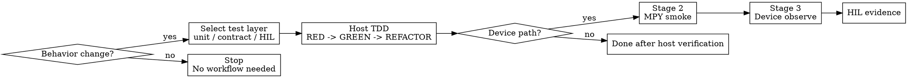

# embedded-development

# Overview
统一本仓库的开发入口：先按 `unit/contract/HIL` 选对测试层，再按是否进入设备路径决定是否继续执行 `stage1 -> stage2 -> stage3 -> HIL`。这个 skill 同时覆盖分层 TDD、设备门禁、硬件集成与实时性约束，避免多个 skill 在同一任务里重复触发。

核心原则：**行为改动必须先有失败测试；进入设备路径后，主机侧通过只是起点，不是终点。**

## Required Background
- **REQUIRED SUB-SKILL:** superpowers:test-driven-development
- **REQUIRED SUB-SKILL:** `mpy-cli`
- **REQUIRED SUB-SKILL:** `verification-before-completion`
- 涉及 PID、运动学、里程计或轨迹行为时，追加 `control-system`

## When to Use
- 新增功能、修复问题、重构行为，需要判断先写 `tests/unit/`、`tests/contract/` 还是 `tests/hil/`
- 改动触及 `src/services/transport_car.py`、`src/hardware/`、外设驱动、实时控制循环或板端状态机
- 需要验证 UART、PWM、电机、编码器、IMU、ticker、5ms 控制周期预算
- 需要执行板端 smoke、设备观测、HIL 留证，或你已经发现主机 `pytest` 不能充分证明结果

不要用于：
- 纯文档修改
- 不改变行为的纯重命名或纯格式整理



## Step 1: Select Test Layer

### `tests/unit/`
- 纯逻辑、确定性算法、解析器、路由、存储、工具函数
- 目标是最快锁定输入输出和边界条件

### `tests/contract/`
- `src/services/commands/`、命令处理器、协议路由、副作用契约
- 目标是锁定命令入口、返回结构、错误路径与注册行为

### `tests/hil/`
- 真实设备、真实时序、真实外设、真实控制循环验证
- 当改动触及硬件路径时，`tests/hil/` 是最终留证层，不是可选项

## Step 2: `stage1` Host TDD Gate
1. 先写失败测试（RED），并确认失败原因与预期一致
2. 再写最小实现（GREEN）
3. 保持通过后再重构（REFACTOR）
4. 运行对应主机测试，直到目标范围全绿

常用命令：

```bash
python3 -m pytest tests/unit -q
python3 -m pytest tests/contract -q
python3 -m pytest tests/unit tests/contract -q
```

进入下一阶段前必须满足：
- 对应失败测试先写且失败原因为预期
- 主机侧目标测试全绿
- 没有已知但未覆盖的协议入口、状态机分支或异常路径

## Step 3: Decide Whether This Is a Device Path
满足任一条件，就进入设备路径：
- 修改了 `src/hardware/`
- 修改了 `src/services/transport_car.py`
- 变更依赖真实串口、编码器、IMU、电机、ticker 或板端状态
- 需要证明 5ms 控制周期预算、方向一致性、传感器稳定性或真实动作链路

若以上都不满足，则在主机侧验证通过后即可结束。

## Step 4: Device Stages

### `stage2` MPY smoke
目的：验证连接、同步、导入、安全探针、最小查询链路与裸片最小运行是否正常，不验证真实硬件动作。

默认做法：
- 先用 `mpy-cli plan`
- 再用 `mpy-cli upload/run/delete`
- 运行安全 smoke 探针，例如 `tools/run_stage2_smoke.py`

必须验证：
- 设备可连接
- 目标文件可上传与执行
- 运行时模块可导入
- 需要的 query / smoke 接口已注册
- 若存在安全模式，其入口可见且可用

禁止项：
- 不要在 `stage2` 里直接启动真实电机、编码器或 IMU 动作链路
- 不要把 `stage2` 失败当成“板子问题”后直接跳过

### `stage3` Device observe
目的：在真实设备运行下通过 `uart3` 做人工调试，确认具体逻辑行为和故障归因。

默认做法：
- 保持 `uart6` 继续服务 OpenArt 或正式通信链路
- 通过 `uart3` 人工发送查询或调试命令，读取 `health/tick/imu/enc/motor/vision` 等快照
- 由人和 AI 在环分析现象，不再把 `stage3` 当作自动 PASS / FAIL 脚本

必须验证：
- 状态可读且格式稳定
- 失败可归因
- 关键实时约束未被破坏，尤其是 5ms 控制周期预算

### `HIL` evidence
目的：把真实板结果留在 `tests/hil/`，作为最终完成证据。

必须包含：
- 操作步骤或测试命令
- 预期行为
- 实际输出或测量结果
- PASS / FAIL 结论

## Hardware And Real-Time Guardrails
- 每个外设一个独立模块，接口最小化，业务编排放 `services/`
- 驱动层不夹带业务逻辑，避免跨层耦合
- 串口处理默认非阻塞，避免等待式读取
- PWM、方向切换与占空比限幅要原子化处理
- 中断回调只置标志，不执行重计算或阻塞 I/O
- 关键路径避免动态分配和大字符串操作
- 新增逻辑必须评估耗时，建议用 `ticks_us` 量测
- 若控制周期超预算，先降复杂度，再讨论新特性
- 电机方向、编码器方向与运动学坐标系必须一致
- IMU 设备 ID、零漂校准文件和读数稳定性必须可验证

## Failure Classification
- `connect_failed`：串口或设备不可达
- `deploy_failed`：上传、删除或远端路径映射失败
- `probe_failed`：smoke / observe 探针自身异常
- `observe_failed`：设备运行了，但状态、方向、阈值或周期不满足
- `hil_pending`：主机和设备阶段已通过，但尚未完成 `tests/hil/` 留证

## Quick Reference

| 场景 | 先做什么 | 何时结束 | 额外交付物 |
| --- | --- | --- | --- |
| 纯逻辑 / 算法 / 工具 | `tests/unit/` RED -> GREEN -> REFACTOR | 主机测试全绿 | 无 |
| 命令 / 协议 / 路由 | `tests/contract/` RED -> GREEN -> REFACTOR | 主机测试全绿 | 无 |
| 设备路径但未上板 | 先完成 `stage1` 主机 TDD | 主机测试全绿后再决定是否接板 | 无 |
| 硬件 / 板端 / 实时行为 | `stage1 -> stage2 -> stage3 -> HIL` | `tests/hil/` 留证完成 | smoke、observe、HIL 证据 |

## Deliverables
- 对应层级的失败测试与通过命令
- 若进入设备路径：`mpy-cli` 命令、smoke 输出、观测输出与失败归因
- 若触及硬件路径：`tests/hil/` 下的最终证据记录
- 已知硬件限制、实时性风险与规避建议

## Red Flags
- “先把代码写完再补测试”
- “主机测试过了，就不用上板了”
- “直接让车动一下看看”
- “Stage 2 失败不重要，先看 Stage 3”
- “看到串口有输出就算完成”
- “HIL 以后再补”

以上任何一条都意味着：**回到分层 TDD 与设备门禁顺序，重新执行。**
