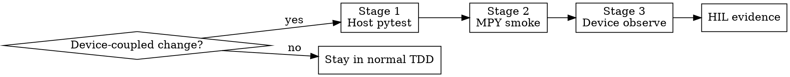

# tdd-with-device

# Overview
把本仓库的设备耦合开发统一为 `stage1 -> stage2 -> stage3 -> HIL` 的强制 TDD 工作流。

核心原则：**涉及设备路径的改动,本地 `pytest` 只是开始,不是结束。**

## Required Background
- **REQUIRED SUB-SKILL:** Use `tdd-integration`
- **REQUIRED SUB-SKILL:** Use `mpy-cli`
- **REQUIRED SUB-SKILL:** Use `hardware-integration`
- **REQUIRED SUB-SKILL:** Use `verification-before-completion`

## When to Use
- 改动触及 `src/services/transport_car.py`
- 改动触及 `src/hardware/`
- 改动需要真实板验证 UART、IMU、编码器、电机、ticker、实时状态
- 用户明确要求 stage 1 / stage 2 / stage 3 的完整设备调试流程
- 你发现仅靠 `tests/unit` / `tests/contract` 不能证明结果在板端可运行

不要用于：
- 纯主机侧逻辑改动,且不进入设备运行路径
- 仅文档修改或纯测试重构

## Stage Flow

### `stage1` Host pytest

目的：
- 用 `tests/unit/` / `tests/contract/` 锁定行为
- 必须完成 RED -> GREEN -> REFACTOR

进入条件：
- 任何设备耦合改动都先从这里开始

通过条件：
- 对应失败测试先写且失败原因为预期
- 目标主机测试全绿
- 没有已知但未覆盖的协议入口或状态机分支

失败时：
- 停在主机侧修复,不得进入 `stage2`

### `stage2` MPY smoke

目的：
- 只验证设备连接、文件同步、模块导入、安全探针和最小查询链路
- **不** 在该阶段验证真实硬件动作

默认做法：
- 先用 `mpy-cli plan`
- 再用 `mpy-cli upload/run/delete`
- 运行安全 smoke 探针,例如 `tools/stage2_smoke_probe.py`

必须验证：
- 设备可连接
- 目标文件可上传与执行
- 运行时模块可导入
- Stage 2 需要的 query / smoke 接口已注册
- 若存在安全模式,其入口已可见并可用

禁止项：
- 不要在 `stage2` 里直接启动真实电机/编码器/IMU 动作链路
- 不要把 `stage2` 失败当作“板子问题”后直接跳过

通过条件：
- smoke 输出成功
- 无 `connect_failed` / `deploy_failed` / `probe_failed`

失败时：
- 先修兼容性、导入链、缓存污染、设备脚本内存占用或部署路径问题
- 必要时回到 `stage1` 增补主机侧回归
- **不得直接进入 `stage3`**

### `stage3` Device observe

目的：
- 在真实设备运行下读取结构化状态,判断实时行为是否正确

默认做法：
- 使用专门的设备观测入口,例如 `tools/run_device_observe.py`
- 读取 `health/tick/imu/enc/motor/vision` 等快照

必须验证：
- 状态可读且格式稳定
- 失败可归因
- 关键实时约束未被破坏,尤其是 5ms 控制周期预算

通过条件：
- 观测脚本运行成功
- 关键快照齐全
- 无 `observe_failed`

失败时：
- 若是观测基建问题,回退到 `stage2`
- 若是控制或硬件运行问题,结合 `hardware-integration` 分析,必要时回退到 `stage1`

### `stage4` HIL evidence

目的：
- 记录真实板结果,作为最终完成证据

必须包含：
- 操作步骤 / 测试命令
- 预期行为
- 实际输出或测量结果
- PASS / FAIL

## Gate Rules
- 不允许跳过 `stage1`
- 不允许 `stage1` 未通过就做 `stage2`
- 不允许 `stage2` 未通过就做 `stage3`
- 不允许只给手工口头结论而没有设备输出证据
- 不允许把 `stage3` 当成替代主机侧 TDD
- 若改动触及硬件路径,最终必须留下 `tests/hil/` 证据

## Failure Classification

设备阶段至少按以下类别归因：

- `connect_failed`：串口或设备不可达
- `deploy_failed`：上传、删除或远端路径映射失败
- `probe_failed`：安全 probe / 观测 probe 本身异常
- `observe_failed`：设备跑起来了,但状态或阈值不满足
- `hil_pending`：主机和设备阶段通过,但尚未完成 HIL 留证

## Deliverables
- `stage1` 的失败测试与通过命令
- `stage2` 的 `mpy-cli` 执行命令与 smoke 输出
- `stage3` 的观测输出与失败归因
- `tests/hil/` 下的最终证据记录

## Quick Reference

| 阶段 | 目标 | 默认入口 | 不该做什么 |
| --- | --- | --- | --- |
| `stage1` | 锁定行为 | `python3 -m pytest ...` | 不写代码先上板 |
| `stage2` | 验证连通与导入 | `mpy-cli upload/run/delete` | 不跑真实硬件动作 |
| `stage3` | 验证实时状态 | `tools/run_device_observe.py` | 不跳过失败归因 |
| `HIL` | 最终留证 | `tests/hil/` | 不只口头宣称通过 |

## Red Flags
- “本地测试过了,先跳过设备 smoke”
- “直接上真实板看看”
- “Stage 2 失败不重要,先看 Stage 3”
- “板端能跑就说明主机测试够了”
- “看到车动了就算完成”

以上任何一条都意味着：**回到门禁顺序,按 `stage1 -> stage2 -> stage3 -> HIL` 重新执行。**
