# wireless_uart

- 原始说明书: [逐飞科技 无线转USB_串口说明书 V2.3](https://gitee.com/seekfree/Wireless_Uart_Product/blob/master/%E3%80%90%E6%96%87%E6%A1%A3%E3%80%91%E8%AF%B4%E6%98%8E%E4%B9%A6%20%E8%8A%AF%E7%89%87%E6%89%8B%E5%86%8C%E7%AD%89/%E9%80%90%E9%A3%9E%E7%A7%91%E6%8A%80%20%E6%97%A0%E7%BA%BF%E8%BD%ACUSB_%E4%B8%B2%E5%8F%A3%E8%AF%B4%E6%98%8E%E4%B9%A6%20V2.3.pdf)
- 原始项目: [Wireless_Uart_Product](https://gitee.com/seekfree/Wireless_Uart_Product)
- 配图目录: [images](./images/)

## 目录

1. [产品介绍](#1-产品介绍)
2. [硬件说明](#2-硬件说明)
3. [使用说明](#3-使用说明)
4. [模块参数配置](#4-模块参数配置)
5. [各个版本对比与实物图](#5-各个版本对比与实物图)
6. [文档版本](#6-文档版本)
7. [全部图片索引](#全部图片索引)

## 封面

2023

## 1. 产品介绍

逐飞科技推出的无线转 USB/串口模块是基于串口来进行无线通信的模块产品。相较于其他无线通信模块产品, 用户无需了解其他新的知识, 仅需要知道基本的串口通信规则, 就能轻松使用本产品来进行各种开发。

无线转串口模块示意图

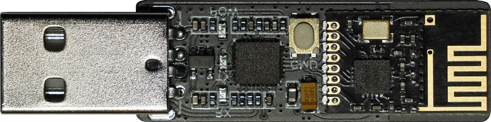

无线转 USB 模块示意图

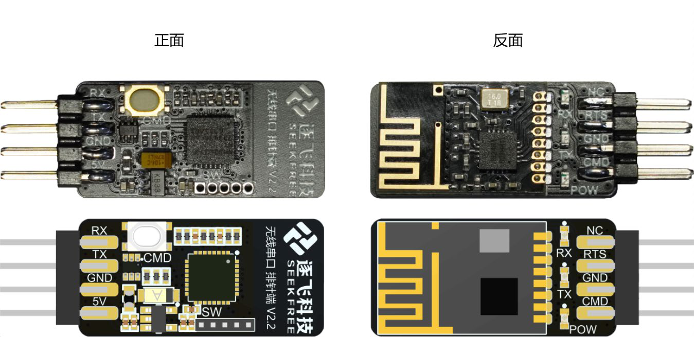

### 1.1. 技术参数

1. 供电输入电压: 3.3V ~ 5V。
2. 接口: 无线转串口为双排 2*4P 插针式接口; 无线转 USB 为 USB 接口。
3. 支持波特率范围: 9600、57600、115200、230400、460800、921600。

### 1.2. 产品特性

1. 系统兼容性强: 支持 WIN7、WIN8、WIN10 的 32 位、64 位系统。
2. 多频道: 可选 123 个频道工作, 多个模块在不同频道下通信之间互不干扰。
3. 距离传输: 无障碍、电磁干扰少的环境下, 最大传输距离约为 10m; 复杂室内环境、电磁干扰严重的情况下, 传输距离将会受限。
4. 转发速度快: 本模块采用高性能 cortex-M4 单片机(150MHz 主频) 来进行数据转发, 转发速度更快, 模块最大传输速度能够达到 40KB/S 以上(无电磁干扰的情况)。
5. 支持自定义配置参数: 可以采用 AT 指令或者配套的专用上位机对模块进行参数配置, 推荐使用上位机进行参数配置。
6. 波特率自适应: USB 端可自动适配软件波特率; 排针端使用本公司提供的例程时, 通过修改宏定义 `WIRELESS_AUTO_UART_BAUD` 设置为 1 可实现自动波特率识别。
7. 无线参数设置: USB 端与排针端均进入配置模式时, 上位机对 USB 端进行参数配置, 配置的参数会同步发送至排针端并保存。无需单独对排针端进行参数配置。
8. STC 无线下载: 支持使用无线串口排针端对 STC 系列单片机进行无线下载。

## 2. 硬件说明

本部分讲解无线转 USB 与无线转串口模块的硬件部分, 主要包括接口、线序、指示灯。无线转 USB 模块部分与电脑 USB 接口相连接, 不与单片机连接。无线转串口端可以与单片机、USB 转 TTL 模块、各类串口传感器模块或 3V3 信号电压的串口通讯接口连接。

无线串口模块引脚编号示意图

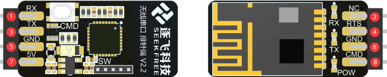

无线串口模块封装引脚编号对应示意图:

| 编号 | 名称 | 引脚功能 | 注意事项 |
| --- | --- | --- | --- |
| 1 | RX | 模块数据串口接收 | 信号电压 0V - 3V3, 此引脚不使用时应当串接 10K 电阻接到 3V3 |
| 2 | NC | 空引脚 | 此引脚没有电气连接, 默认悬空不接任何信号 |
| 3 | TX | 模块数据串口输出 | 信号电压 0V - 3V3, 此引脚不使用时应当串接 10K 电阻接到 3V3 |
| 4 | RTS | 发送流控引脚 | 信号电压 0V - 3V3, 此引脚不使用时应当串接 10K 电阻接到 3V3 |
| 5 | GND | 电源地 | 接供电的 GND |
| 6 | GND | 电源地 | 接供电的 GND |
| 7 | 5V | 电源 5V 供电 | 接供电默认 5V |
| 8 | CMD | 配置模式引脚 | 低电平进入配置模式, 信号电压 0V - 3V3 |

无线串口模块引脚功能表

### 2.1. 无线转 USB 模块(USB 端)

无线转 USB 部分接口为 USB-A 公头接口, 设计为直接插接电脑 USB 接口使用。

无线转 USB 模块连接示意图

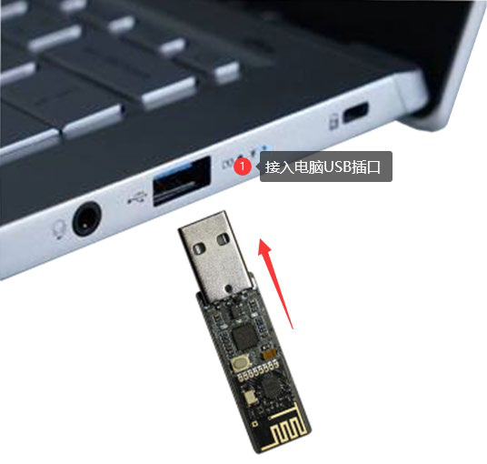

模块上总共有三个灯, 分别是红色电源、绿色接收、蓝色发送三个状态灯:

1. 红色电源灯: 模块插接电脑 USB 后正常供电工作时该红色 LED 亮起, 此 LED 如果熄灭证明模块工作异常, 应当立即断电检查。
2. 绿色接收灯: 当收到数据时该 LED 会闪烁, 当不断接受数据时看起来就像是常亮。
3. 蓝色发送灯: 当模块发送数据该 LED 会闪烁, 不断发送大量数据时看起来是常亮。

无线转 USB 模块 LED 示意图

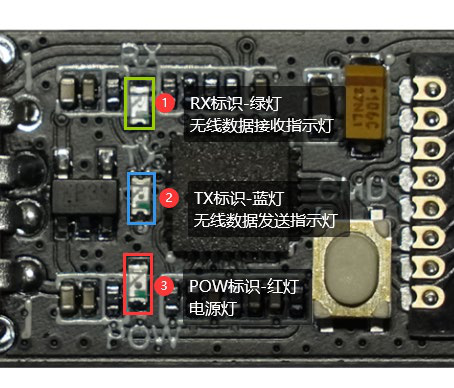

模块接入电脑 USB 口上电时, 正常情况下会看到模块三个 LED 全部亮起进入自检配置。然后绿灯和蓝灯短时间内闪烁两次, 之后绿灯和蓝灯熄灭, 此时设备管理器看到串口设备。

无线转 USB 模块设备成功示意图

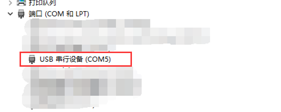

模块上有一个按键, 该按键为配置按键, 当模块接插 USB 接口连接电脑正常工作时, 长按该按键即可进入配置模式。需要特别注意, 务必在模块上电之后才长按这个按键进入配置模式。进入配置模式时蓝绿灯会开始闪烁, 通过无线串口配置上位机完成配置保存退出。再次长按该按键也可退出配置模式, 这样之前配置的参数将会被丢弃, 如果需要保存则应该通过上位机点击保存并退出或者发送保存指令。

无线转 USB 模块按键位置示意图

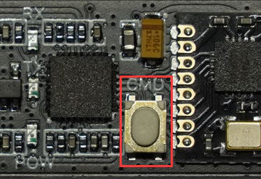

### 2.2. 无线转串口模块(排针端)

无线转串口部分接口为 2x4Pin 的 2.54 间距双排针接口, 设计为使用排座连接单片机串口使用, 或者使用排线、杜邦线连接 USB 转 TTL 模块连接电脑使用。

无线转串口模块接线示意图

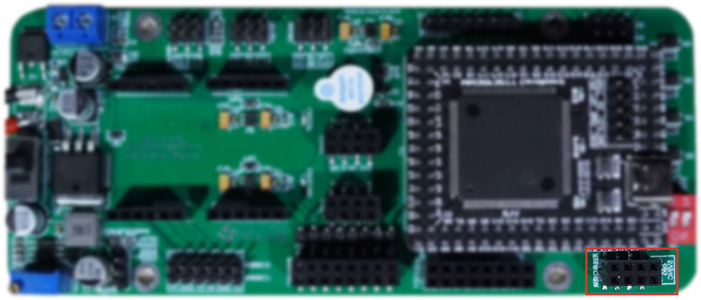

如果是与逐飞科技学习主板连接, 那么主板上有专用的无线转串口模块接口, 可以直接连接无线模块。以 MM32F3277 主板为例, 右上角有一个“无线串口模块”标识的 2x4 排座接口, 这里就是用来专门插无线模块的接口。

逐飞科技学习主板无线模块接口示意图

逐飞科技学习主板无线模块接入示意图

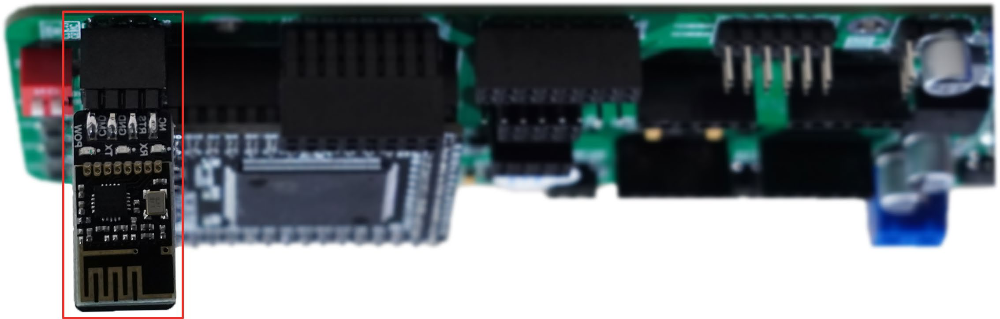

推荐使用学习主板时直接将无线模块接入该接口, 使用主板对应的例程进行测试。接入时请务必检查引脚信号是否对应正常, 逐飞科技学习主板在无线模块接入时 LED 灯朝外。

模块上总共有三个灯, 分别是红色电源、绿色接收、蓝色发送三个状态灯:

1. 红色电源灯: 模块连接单片机或者 USB 转 TTL 后正常供电工作时该红色 LED 亮起, 此 LED 如果熄灭证明模块工作异常, 应当立即断电检查。
2. 绿色接收灯: 当收到数据时该 LED 会闪烁, 当不断接受数据时看起来就像是常亮。
3. 蓝色发送灯: 当模块发送数据该 LED 会闪烁, 不断发送大量数据时看起来是常亮。

无线转串口模块指示灯示意图

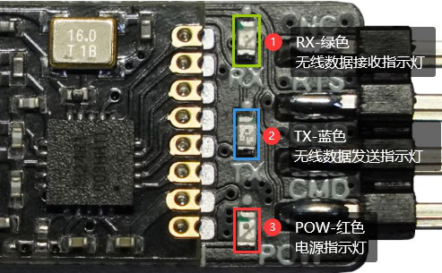

模块上电时, 正常情况下会看到模块在上电后所有灯亮起, 这是进入模块自检, 持续时间很短, 看到的现象是模块的蓝灯和绿灯闪烁了一次。此时可以通过模块收发数据, 但是只能适配模块默认的波特率设置。如果使用的是我们提供的例程驱动, 并且在驱动源码的对应头文件中开启了自动波特率识别宏定义, 那么会在模块收到自动波特率识别特征时进入自动波特率适配模式, 过程会比较短, 观察的现象是蓝灯和绿灯额外闪烁一次。

无线转串口模块驱动源码设置示意图

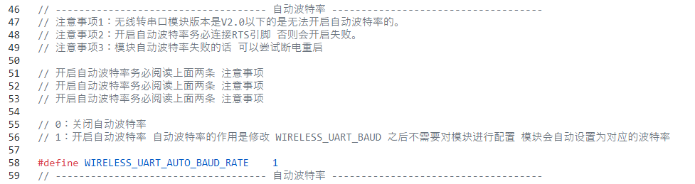

模块上有一个按键, 该按键为配置按键, 当模块连接到单片机或者 USB 转 TTL 上正常上电工作时, 长按该按键即可进入配置模式。需要特别注意, 务必在模块上电之后才长按这个按键进入配置模式。进入配置模式时蓝绿灯会闪烁, 完成配置退出。再次长按该按键也可退出配置模式, 但此时配置参数并未生效。

无线转串口模块 CMD 按键示意图

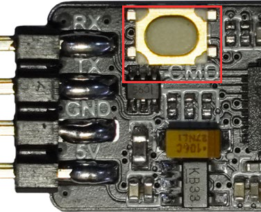

## 3. 使用说明

只要模块配置参数一致, 那么模块就可以相互通信, 但需要注意的是, 同一时刻不能有多个模块一起发送, 否则会进入发送竞争导致无法正常发送数据。一个发送多个接受时, 不能保证每个模块都能正常接收, 发送端收到一个模块的应答信号后就会认为发送成功。

### 3.1. 模块功能完整性检测

如果需要验证模块是否功能性完好, 需要将 USB 端连接电脑, 将排针端使用杜邦线、排线连接 USB 转 TTL 模块连接电脑。此时需要保证两个模块工作在相同的参数下, 否则可能导致测试收发功能失败。如果不确定模块是否工作在相同的参数下, 请参照“模块参数配置”章节内容进行参数配置, 并尽量避免在同一环境下有人使用同类模块时测试。

无线转串口模块连接 USB 转 TTL 示意图

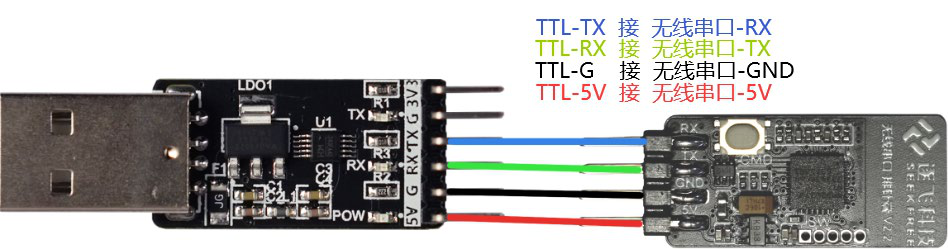

无线转 USB/串口模块连接电脑示意图

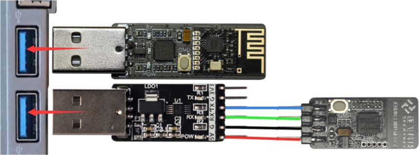

模块出厂默认参数如下:

| 参数名称 | 参数设定值 |
| --- | --- |
| 收/发地址 | 0xFF, 0xFF, 0xFF, 0xFF, 0xFF |
| 波特率 | 115200 |
| 通信频率 | 2.500Ghz |
| 通信速率(空中速率) | 2Mbps |
| CRC 校验位数 | 16bit |
| 自动重发次数 | 10 次 |
| 自动重发最大次数后操作 | 继续发送直至接收端接收到数据 |
| 通信版本 | V210 及以上 |

无线转 USB/串口模块测试结果示意图

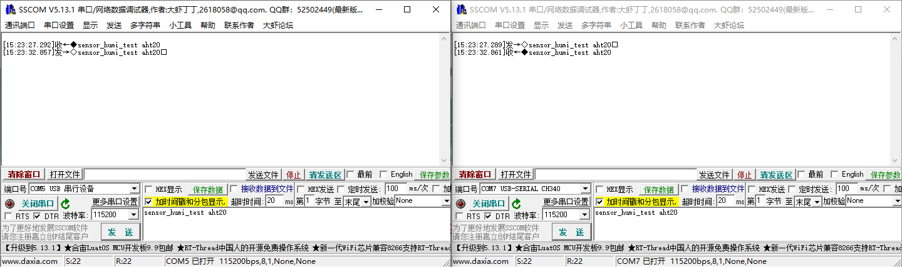

确认连接正确、参数匹配后, 打开电脑串口助手。这里以 sscom 软件进行演示, 同时打开 USB 端与排针端对应的串口, 进行相互发送数据测试。正常情况下双方应该能接收到对方发送的数据。若发现两个模块之间无法正常通信, 那么按照第四章节中的恢复出厂设置部分将两个模块恢复出厂设置, 再进行测试。若依旧无法正常通信, 请联系客服。

### 3.2. 使用无线模块进行 MCU 与电脑通信

将 USB 端连接电脑, 将排针端使用杜邦线、排线或接在逐飞科技学习主板无线模块接口排座上连接单片机, 确认连接正确。连接方式请参照第二章硬件说明。

无线转串口模块连接示意图

确认连接正常后, 主板使用电池供电, 电脑打开串口上位机。这里以逐飞科技学习主板的无线串口使用例程为例, 程序会初始化对应的串口与模块完成准备, 单片机会通过串口发送数据给无线串口模块, 然后无线串口模块会通过无线发送数据到无线 USB 模块, 此时可以在串口助手上看到对应数据。

无线转 USB 模块与无线转串口模块应用于电脑与单片机通信例程结果示意图

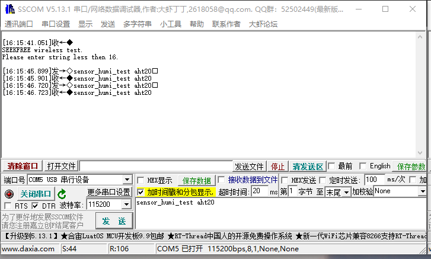

这种使用方式可用于调试参数, 例如将摄像头图像参数上传到电脑上位机进行图像显示, 或者使用虚拟示波器进行参数波形查看。

无线转 USB 模块与无线转串口模块应用于电脑与单片机发送虚拟示波器波形示意图

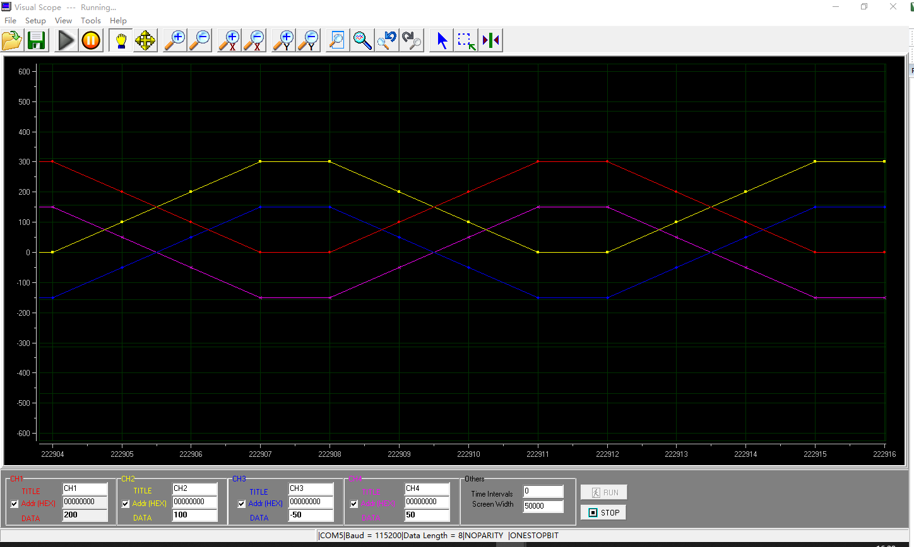

无线转 USB 模块与无线转串口模块应用于电脑与单片机发送摄像头图像示意图

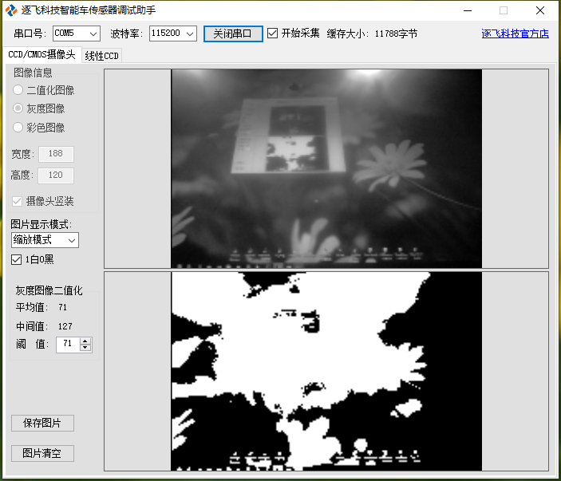

### 3.3. 使用无线模块进行 MCU 间通信

在双车组别中需要两个车模之间相互通信, 那么两个 MCU 可以通过两个排针端进行通信。这里需要保证两个模块配置在同一个参数下工作, 与单片机接线请参照第二章第二节无线转串口模块说明。

逐飞科技学习主板无线模块接入示意图

确认连接正常, 主板使用电池供电后, 需要自行编写测试代码: 首先初始化无线串口模块, 然后编写查询无线串口是否接收到数据, 以及如何通过无线串口定时输出数据。

### 3.4. 设置排针端自动波特率模式与上位机通信

如果使用逐飞科技提供的例程, 可以在无线转串口的驱动头文件中打开自动波特率模式。开启此模式后修改使用的波特率时, 不需要对模块进行重新配置。配置方法如下:

1. 打开对应头文件。
2. 修改对应宏定义为 1。
3. 设置完宏定义后, 波特率可以在 9600、57600、115200、230400、460800 里面设置。
4. 插上模块, 调用无线转串口初始化函数, 模块会根据上述波特率自动匹配。
5. 初始化完成后, 可以直接和 USB 端进行通信。

### 3.5. 使用无线转串口进行 STC 单片机的程序烧录

V2.0 及以上版本的无线转 USB/串口模块可以用于对 STC 系列单片机进行无线下载, 当前测试通过的包括 STC8A、STC8H、STC16 系列单片机。这里以 STC16F 演示:

1. 拿一对已配对好的无线转串口排针端和无线转 USB 端。
2. 将无线转串口排针端连接到单片机, 排针端 RX 连接单片机 P3.1, TX 连接到单片机 P3.0, GND 连接到单片机 GND, VCC 连接到单片机 VCC。然后给单片机上电。
3. 将无线转 USB 模块插到电脑上, 使用 STC-ISP 软件, 选择对应芯片和无线转 USB 连接的串口, 将最低和最高波特率都设置为 115200。

无线转串口模块 STC 无线下载注意事项示意图

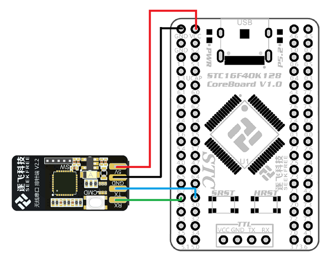

4. 打开程序文件, 点击下载/编程。如果芯片之前没有下载过例程, 点击下载后, 软件右下角会提示正在检测目标单片机。
5. 需要点击一次核心板上的 SRST 按钮, 便会开始下载。
6. 8A、8H 核心板只需要修改相应芯片名称和频率。

## 4. 模块参数配置

用户可以根据自己的开发需要来自定义模块参数。下面给出两种配置方式操作步骤。

### 4.1. 模块进入配置模式以及连接方式

V2.0 及以上版本的无线模块可以通过模块上的按键进入配置模式, 只需要在正常连接模块上电后, 通过长按模块上的按键即可进入配置模式。需要注意的是, 同一时间下只能有一个无线转 USB 模块和一个无线转串口模块进入配置模式。

无线转 USB/串口模块配置说明示意图

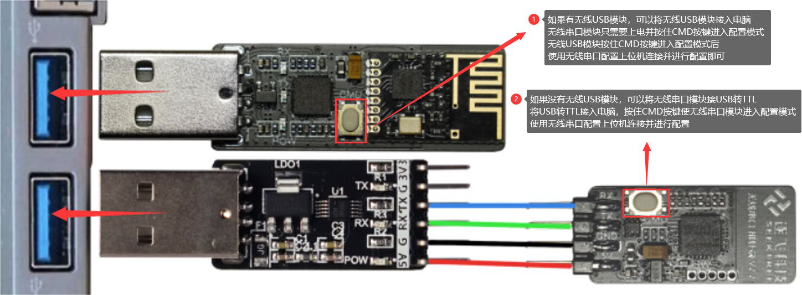

无线转串口模块与无线转 USB 模块进入配置模式后, 会工作在同一个频段。此时上位机对无线转 USB 模块进行参数修改后, 无线转 USB 会将所有的参数同步发送给无线转串口模块, 从而实现排针端无线配置参数, 不用每个模块都配置一次。但务必注意, 同一时间下只能有一个无线转 USB 模块和一个无线转串口模块进入配置模式。如果是不同版本的无线转串口模块也可能无法使用无线配置参数。如果无线转 USB 与无线转串口模块要分别配置成不同的参数, 必须要各自单独配置, 不能同时进入配置模式。

### 4.2. 使用上位机进行参数配置

请务必注意, 请使用 V2.0 及以上版本的无线转串口上位机。只有 V2.0 及以上版本的无线转串口上位机才能对 V2.4 及以上版本的无线转 USB/串口模块进行参数配置。

无线转串口上位机示意图

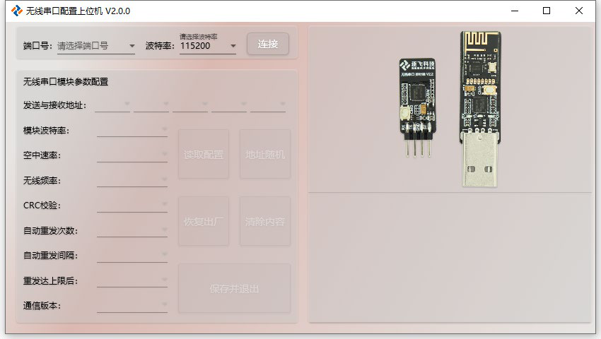

确认接入模块的串口号, 并确认模块进入了配置模式后, 波特率设置为模块的波特率。如果并不知道模块波特率可以选择自动匹配, 然后点击连接。此时如果正常连接, 那么右侧消息框会输出当前模块配置参数。

无线转串口上位机成功连接示意图

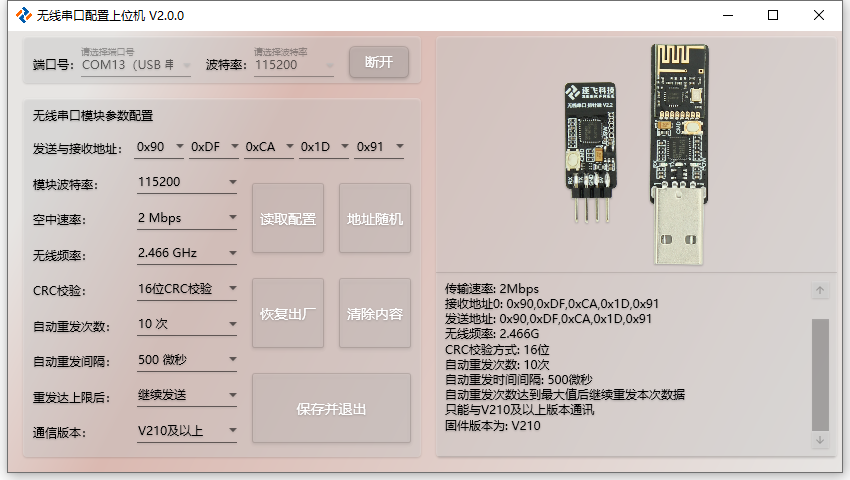

如果模块异常、没有连接模块、没有进入配置模式, 或者串口被其他软件占用, 那么上位机会报错。

无线转串口上位机连接异常示意图

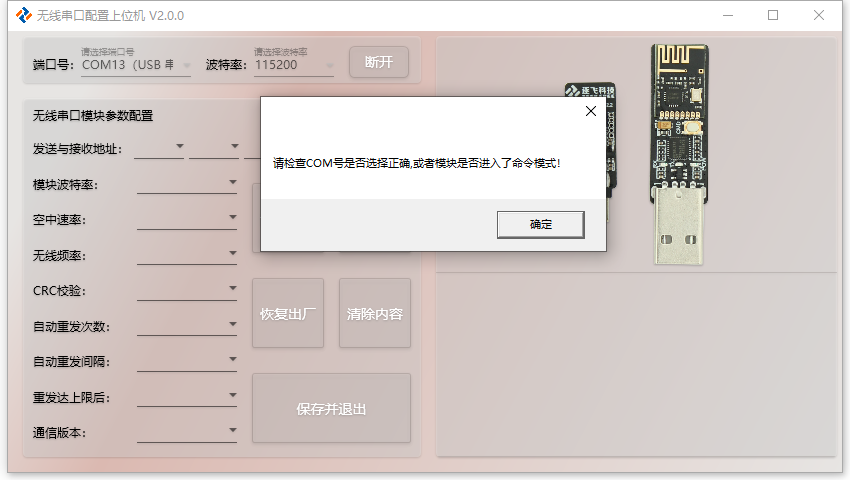

上位机可设置参数为左侧部分:

无线转串口上位机可配置参数示意图

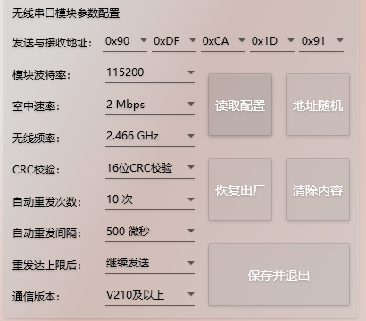
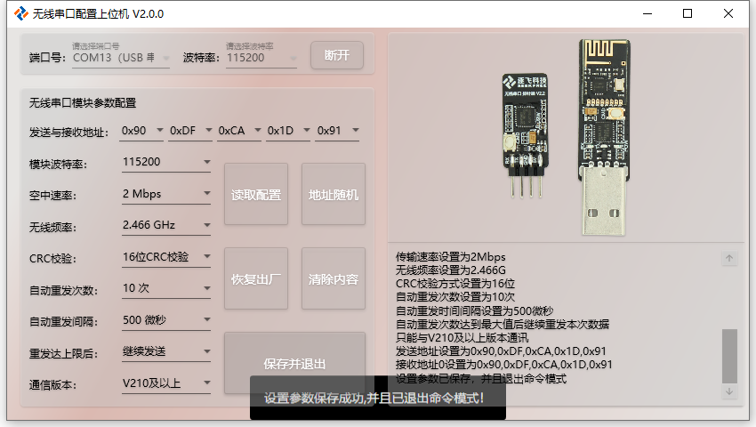

1. 发送与接收地址: 模块的通信配对地址, 地址一致的模块在无线频率一致时可以相互收发数据, 默认为全 0xFF。如果周围有使用同类模块时, 推荐配置成自定义的地址, 可以点击地址随机, 这样不用每个地址都手动选择或填写。
2. 模块波特率: V2.0 版本以下模块的串口波特率。V2.0 及以上版本的 USB 端为 CDC 虚拟串口, 电脑打开串口时设置多少就会被自动设置成对应波特率; V2.0 及以上版本的排针端在没有开启自动波特率识别的时候就会默认使用此模块波特率工作。
3. 空中速率: 无线模块发送的空中速率, 一般不需要修改。
4. 无线频率: 在同一个频率下工作的模块可以相互收发数据, 但设备过多时可能导致无线资源竞争, 导致无法正常收发。在有多对无线转 USB/串口模块同时使用的环境中, 推荐各对无线转 USB/串口模块各自配置成不一样的无线频率, 避免冲突。
5. CRC 校验: 不推荐修改, 默认为 16bit 校验。
6. 自动重发次数: 发送没有收到响应信号时触发重发的次数, 一般不需要修改。
7. 自动重发间隔: 连续丢失响应信号时的重发间隔时间, 一般不需要修改。
8. 重发达上限后: 当连续丢失响应信号, 重发次数达到设定上限时, 决定继续重发数据直到发送成功, 或者丢弃掉当前数据包。
9. 通信版本: 只有硬件版本为 V2.4 才支持设置这个参数。主要在新旧版本混用的时候需要设置这个参数。如果相互通讯的模块都是 V2.4 及以上, 则这个参数应该设置为“V210 及以上”; 否则应该设置为“V200 及以下”。

修改参数后点保存并退出, 即可完成配置, 成功会提示信息。

### 4.3. 使用 AT 指令进行参数配置

先将模块接入电脑并进入配置模式, 或者接入单片机并进入配置模式, 通过串口发送 AT 指令进行配置。

| 操作 | AT 指令 | 说明 |
| --- | --- | --- |
| 波特率设置 | `AT+BAUD=?` `AT+BAUD=1` `AT+BAUD=2` `AT+BAUD=3` `AT+BAUD=4` `AT+BAUD=5` | 分别设置波特率为 9600、57600、115200、230400、460800、921600 |
| 空速设置 | `AT+RATE=?` `AT+RATE=1` `AT+RATE=2` `AT+RATE=3` | 分别设置无线空速为 250kbps、1Mbps、2Mbps |
| 接收地址设置 | `AT+RX=?` `AT+RX=0XFF,0XFF,0XFF,0XFF,0XFF` | 设置接收地址为 `0XFF,0XFF,0XFF,0XFF,0XFF`。这五个值可以任意, 但需要和匹配无线模块的发送地址一致, 且地址不能全设置为 `0x00` |
| 发送地址设置 | `AT+TX=?` `AT+TX=0XFF,0XFF,0XFF,0XFF,0XFF` | 设置发送地址为 `0XFF,0XFF,0XFF,0XFF,0XFF`。这五个值可以任意, 但需要和匹配无线模块的接收地址一致, 且地址不能全设置为 `0x00` |
| 无线频率设置 | `AT+FREQ=?` `AT+FREQ=2.500G` | 设置无线频率为 2.500GHz。可设定值范围 `2.400G~2.525G`, 设定值后面的 0 不可以省略, 且需保证发送模块和接收模块二者无线频率设置一致 |
| CRC 校验设置 | `AT+CRC=?` `AT+CRC=16` | 设定值只有两个: 8 或者 16。通常设置为 16 |
| 自动重发次数 | `AT+ARN=?` `AT+ARN=10` | 设置自动重发次数为 10 次。设定值可选范围 `0~15`, 设为 0 时表示关闭自动重发。通常设定为 10 以保障单次传输成功率 |
| 自动重发时间间隔 | `AT+ART=?` `AT+ART=2` | 设置自动重发间隔时间为 `2*250(us)`。空速为 1 时设定范围为 `8-16`, 空速为 2 时设定范围为 `4-16`, 空速为 3 时设定范围为 `2-16`。通信速率越低, 设置的时间间隔应该越大, 2Mbps 建议设置为 500us |
| 自动重发达到最大次数之后 | `AT+ARM=?` `AT+ARM=0` `AT+ARM=1` | `AT+ARM=0` 表示达到最大次数后继续发送直到数据成功被接收; `AT+ARM=1` 表示重发失败后丢弃本次发送失败的数据, 继续发送后面收到的数据 |
| 通讯版本 | `AT+WVER=?` `AT+WVER=0` `AT+WVER=1` | `AT+WVER=0` 只能与 V200 及以下固件版本通讯, `AT+WVER=1` 只能与 V210 及以上固件版本通讯。只有新模块与旧模块之间需要通讯的时候才需要设置为 0, 两个模块都是新模块则应该设置为 1。这个指令只有 V210 版本中的固件才支持 |
| 恢复默认参数 | `AT+DEF` | 恢复默认参数 |
| 保存参数 | `AT+SAVE` | 保存参数, 重新进行初始化并退出命令模式 |
| 取消设置并退出 | `AT+CANCEL` | 取消设置的参数并退出命令模式 |
| 测试指令并回传 | `AT?` | 测试指令并回传当前配置参数 |

注意:

1. 所有命令均为大写, 标点符号必须英文状态下的半角标点, 无空格。
2. 不可更改的参数: 地址长度必须为 5 位。
3. 数据包总长度必须是 31 个字节(包含第一个系统预留位)。
4. 发射功率为 7dbm。
5. 使用串口助手进行配置时, 发送与接收应该选择 ASCII 码。

## 5. 各个版本对比与实物图

### 5.1. 硬件版本

无线转 USB/串口模块经过多次优化升级, 目前硬件有三个主要版本。

1. V1.1 版本是第一代模块, 功能比较精简。

V1.1 版本实物图

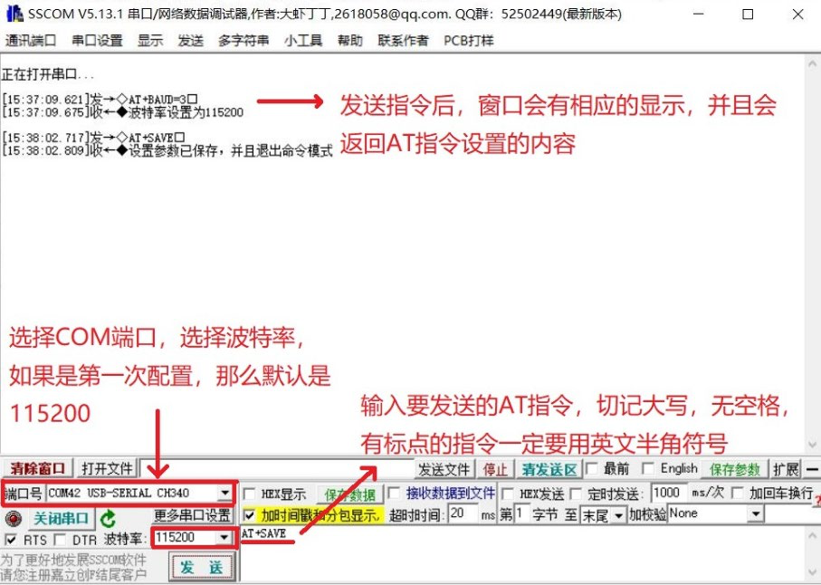

2. V2.2 版本是第二代模块, 其中排针端又更新为 V2.3。这个版本与 V2.2 几乎一样, 仅仅是给串口引脚添加了上拉电阻。相较于第一代增加了一些新的功能:
   - USB 端波特率支持自适应, 可以支持任意波特率。
   - 排针端支持发送特定数据实现波特率自动识别。
   - 排针端支持通过无线来进行参数配置, 提高使用便捷性。
   - 支持给 51 单片机无线下载程序。

V2.2 / V2.3 版本配图

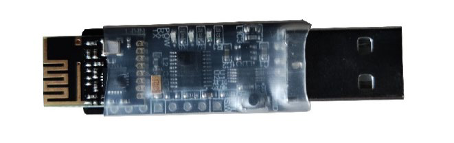
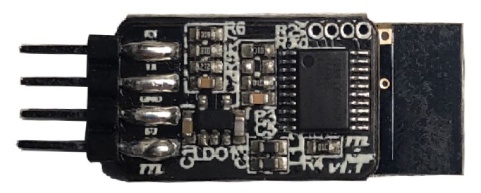
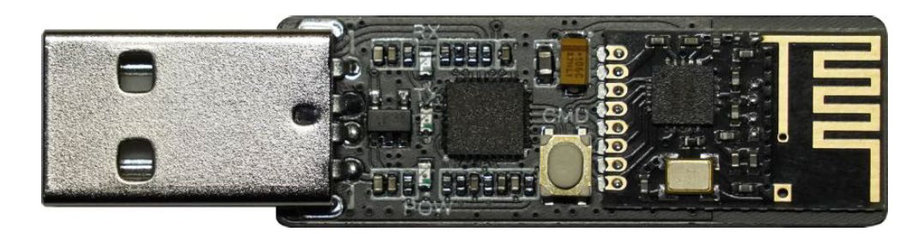
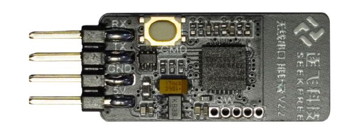

3. V2.4 版本是最新版本的模块, 相较于 V2.2 版本主要是更换了性能更强劲的 MCU 来进行数据转发, 并且增加了更为严格的数据校验, 使得通信可靠性进一步提高。由于增加了数据校验, 默认状态无法与之前的模块通讯。如果需要与之前的模块进行通讯, 可以使用上位机对模块进行参数配置, 将参数通讯版本选择为 `V2.0 及以下`。建议尽量都使用最新模块。V2.4 需要特别注意以下情况:
   - 在使用新版本无线转 USB 与旧版本无线转串口端进行无线参数配置的时候, 需要先将新版本无线转 USB 端的通信版本配置为 `V2.0 及以下`, 重新给模块上电, 再次进入配置模式后才能正常通过无线来配置排针端。
   - 在使用旧版本 USB 端与新版本排针端时也是同理, 需要先将排针端的通信版本配置为 `V2.0 及以下`, 重新给模块上电, 再次进入配置模式后才能正常通过无线来配置排针端。
   - 模块上的按键在上电的时候不允许被按下。如果按住按键给模块上电, 会导致模块进入下载固件的模式, 进而不能正常运行。如果需要进入配置模式, 必须先给模块供电之后再长按按键进入配置模式。
   - 增加了 921600 波特率, 可以大幅降低用户主控与无线模块的数据发送时间。
   - 在使用 V2.4 版本 USB 端与 V2.3 及以下版本排针端进行无线参数配置时, 由于 V2.3 及以下版本不支持 921600 波特率, 因此配置参数时波特率选项不能设置为 921600。
   - 当使用一个 V2.4 版本模块发送、V2.3 及以下版本排针端接收时, 可能出现数据丢失。因为 V2.3 及以下版本排针端最大波特率为 460800, 换算下来最大速度约为 45KB 每秒, 而新版本无线模块的数据转发能力可能超过这个速度。

V2.4 版本 USB 端

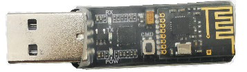

V2.4 版本排针端

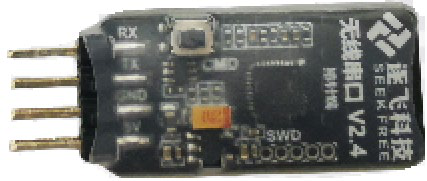

### 5.2. 固件版本

除了硬件版本, 还有固件版本。固件版本表示模块内部程序的版本, 例如通信版本参数中的固件版本 `V200` 和 `V210`。

`V210` 版本对比 `V200` 版本主要在通信的数据包中加入了 CRC 校验, 并增加了 921600 波特率选项, 进一步提高了通信可靠性。由于使用的是硬件 CRC 单元进行计算, 因此几乎不影响模块的转发速度。由于 `V210` 版本加入了 CRC 校验, 因此默认情况下无法与旧版本通讯。如果需要使用 `V210` 版本固件与 `V200` 版本固件通讯, 则需修改通信版本参数。具体细节可以查看“使用上位机进行参数配置”章节中通信版本参数的详细描述。

## 6. 文档版本

| 版本号 | 日期 | 作者 | 内容变更 |
| --- | --- | --- | --- |
| V1.0 | 2020-07-20 | XK | 初始版本 |
| V1.1 | 2020-07-27 |  | 添加解决模块干扰的方法 |
| V1.2 | 2021-01-22 |  | 修改引脚说明处的图片 |
| V1.3 | 2021-05-08 | XK | 添加使用说明及自定义配置处的接线示意图, 修改部分文字说明 |
| V2.0 | 2021-08-05 | TQC | 新版 V2.x 无线串口 |
| V2.1 | 2022/3/7 | ZSY | 修改部分说明 |
| V2.2 | 2023/7/26 | ZSY | 增加自动波特率使用说明 |
| V2.3 | 2023/9/05 | XK | 增加版本对比与实物图、V2.4 版本新增指令、配置按键的强调 |

## 全部图片索引

### 第 1 页

- [page01-figure01.png](./images/page01-figure01.png)
- [page01-figure02.png](./images/page01-figure02.png)

### 第 4 页

- [page04-figure01.png](./images/page04-figure01.png)
- [page04-figure02.png](./images/page04-figure02.png)

### 第 6 页

- [page06-figure01.png](./images/page06-figure01.png)

### 第 7 页

- [page07-figure01.png](./images/page07-figure01.png)
- [page07-figure02.png](./images/page07-figure02.png)

### 第 8 页

- [page08-figure01.png](./images/page08-figure01.png)
- [page08-figure02.png](./images/page08-figure02.png)

### 第 9 页

- [page09-figure01.png](./images/page09-figure01.png)

### 第 10 页

- [page10-figure01.png](./images/page10-figure01.png)
- [page10-figure02.png](./images/page10-figure02.png)

### 第 11 页

- [page11-figure01.png](./images/page11-figure01.png)
- [page11-figure02.png](./images/page11-figure02.png)

### 第 12 页

- [page12-figure01.png](./images/page12-figure01.png)
- [page12-figure02.png](./images/page12-figure02.png)

### 第 13 页

- [page13-figure01.png](./images/page13-figure01.png)

### 第 14 页

- [page14-figure01.png](./images/page14-figure01.png)
- [page14-figure02.png](./images/page14-figure02.png)

### 第 15 页

- [page15-figure01.png](./images/page15-figure01.png)
- [page15-figure02.png](./images/page15-figure02.png)

### 第 16 页

- [page16-figure01.png](./images/page16-figure01.png)
- [page16-figure02.png](./images/page16-figure02.png)

### 第 17 页

- [page17-figure01.png](./images/page17-figure01.png)
- [page17-figure02.png](./images/page17-figure02.png)

### 第 18 页

- [page18-figure01.png](./images/page18-figure01.png)
- [page18-figure02.png](./images/page18-figure02.png)

### 第 19 页

- [page19-figure01.png](./images/page19-figure01.png)
- [page19-figure02.png](./images/page19-figure02.png)

### 第 20 页

- [page20-figure01.png](./images/page20-figure01.png)

### 第 21 页

- [page21-figure01.png](./images/page21-figure01.png)
- [page21-figure02.png](./images/page21-figure02.png)

### 第 22 页

- [page22-figure01.png](./images/page22-figure01.png)
- [page22-figure02.png](./images/page22-figure02.png)

### 第 24 页

- [page24-figure01.png](./images/page24-figure01.png)

### 第 26 页

- [page26-figure01.png](./images/page26-figure01.png)

### 第 27 页

- [page27-figure01.png](./images/page27-figure01.png)
- [page27-figure02.png](./images/page27-figure02.png)
- [page27-figure03.png](./images/page27-figure03.png)

### 第 28 页

- [page28-figure01.png](./images/page28-figure01.png)

### 第 29 页

- [page29-figure01.png](./images/page29-figure01.png)
- [page29-figure02.png](./images/page29-figure02.png)
